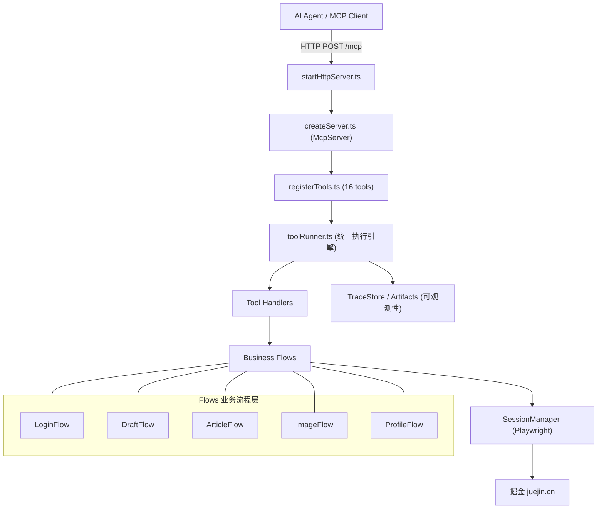

# Juejin MCP Server — 项目分析

## 项目概述

这是一个基于 **TypeScript** 的 **MCP (Model Context Protocol) Server**，用于通过 **Playwright** 浏览器自动化操作掘金（juejin.cn）平台。它允许 AI Agent 通过标准 MCP 协议调用工具来完成登录、发文、上传图片、查看文章等操作。

> [!IMPORTANT]
> 这不是一个调用掘金 API 的项目——它通过 **Playwright 启动真实浏览器** 来模拟用户操作，适用于掘金没有公开 API 的场景。

---

## 技术栈

| 类别 | 技术 |
|------|------|
| 语言 | TypeScript 5.5 (ESM, target ES2022) |
| 运行时 | Node.js ≥ 20 |
| MCP SDK | `@modelcontextprotocol/sdk` (Streamable HTTP 传输) |
| 浏览器自动化 | Playwright (chromium) |
| 参数校验 | Zod |
| 日志 | Pino |
| 构建 | tsup |
| 开发工具 | tsx, ESLint, Prettier, Vitest |

---

## 架构总览



---

## 源码结构 (27 files)

```
src/
├── index.ts                      # 入口，调用 startHttpServer()
├── server/
│   ├── createServer.ts           # 创建 McpServer 实例
│   └── startHttpServer.ts        # HTTP 服务 (POST/GET/DELETE /mcp + /health)
├── session/
│   └── SessionManager.ts         # Playwright 持久化浏览器会话管理
├── runtime/
│   └── toolRuntime.ts            # ToolRuntime 依赖注入容器
├── flows/                        # 业务流程层 (Playwright 操作封装)
│   ├── LoginFlow.ts              # 登录状态机 (SMS 验证码流程)
│   ├── DraftFlow.ts              # 草稿创建 + 发布 (两阶段)
│   ├── ArticleFlow.ts            # 文章查看 + 列表
│   ├── ImageFlow.ts              # 图片上传
│   ├── ProfileFlow.ts            # 个人资料获取
│   └── browserUtils.ts           # 选择器降级、重试等通用浏览器工具
├── tools/                        # MCP 工具定义与注册
│   ├── registerTools.ts          # 注册全部 16 个工具
│   ├── types.ts                  # ToolDefinition / ToolHandlerContext 类型
│   ├── pingTool.ts               # tool.ping
│   └── handlers/
│       ├── sessionHandlers.ts    # session_init/close/status, ensure_login, debug_*
│       ├── loginHandlers.ts      # login_send_sms_code, login_verify_sms_code
│       ├── contentHandlers.ts    # image_upload, draft_*, article_*, profile_*
│       └── pingHandler.ts       # tool.ping handler
├── shared/                       # 共享基础设施
│   ├── config.ts                 # AppConfig (环境变量读取)
│   ├── errorCodes.ts             # ToolStatus / ToolCode 枚举
│   ├── errors.ts                 # toAppError 通用转换
│   ├── logger.ts                 # Pino logger
│   ├── result.ts                 # ToolResult 统一返回结构
│   ├── toolError.ts              # ToolError 自定义异常
│   └── toolRunner.ts             # runTool() 统一工具执行引擎
└── observability/
    ├── TraceStore.ts             # TraceRecorder / TraceStore (追踪链路)
    └── Artifacts.ts              # 截图 + HTML dump 采集
```

---

## 核心模块详解

### 1. HTTP 服务层 (`server/`)

[startHttpServer.ts](file:///c:/Users/pika/IdeaProjects/Juejin-MCP-Server/src/server/startHttpServer.ts) 实现了完整的 **Streamable HTTP** MCP 传输协议：

- `POST /mcp` — 发送 JSON-RPC 请求（含初始化）
- `GET /mcp` — SSE 流式通道（需 `mcp-session-id`）
- `DELETE /mcp` — 关闭会话
- `GET /health` — 健康检查

支持多会话管理，带 graceful shutdown (SIGINT/SIGTERM)。

### 2. 会话管理 (`session/SessionManager`)

[SessionManager.ts](file:///c:/Users/pika/IdeaProjects/Juejin-MCP-Server/src/session/SessionManager.ts) 封装了 Playwright 的 `chromium.launchPersistentContext`：

- **持久化上下文** — Cookie/localStorage 跨调用保留（实现登录态持久化）
- 支持 **proxy**、**locale**、**headless** 等配置
- 自动创建 `traces/`、`idempotency/`、`tmp/` 目录
- 幂等初始化（相同参数不重复启动浏览器）

### 3. 业务流程层 (`flows/`)

每个 Flow 类封装一组相关的 Playwright 页面操作：

| Flow | 职责 | 关键方法 |
|------|------|----------|
| `LoginFlow` | 登录状态检测、SMS 验证码发送/验证 | `ensureLogin()`, `sendSmsCode()`, `verifySmsCode()` |
| `DraftFlow` | 草稿创建（含幂等）、发布（含定时） | `createDraft()`, `publishDraft()` |
| `ArticleFlow` | 文章详情获取、我的文章列表 | `getArticle()`, `listMine()` |
| `ImageFlow` | 图片上传（支持 URL/Base64） | `uploadImages()` |
| `ProfileFlow` | 个人资料获取 | `getSelf()` |

> [!NOTE]
> `browserUtils.ts` 提供了 **选择器降级机制**（`SelectorCandidate[]`），每个操作提供多个选择器候选项（role → text → css → placeholder），按优先级依次尝试，增强了对掘金页面变更的鲁棒性。

### 4. 工具运行器 (`shared/toolRunner.ts`)

[toolRunner.ts](file:///c:/Users/pika/IdeaProjects/Juejin-MCP-Server/src/shared/toolRunner.ts) 是核心执行引擎：

1. 为每次调用生成 `traceId` (UUID)
2. 创建 `TraceRecorder` 记录执行链路
3. 通过 Zod 校验输入参数
4. 调用 handler 执行业务逻辑
5. 异常时自动采集截图 + HTML dump
6. 完成 trace 并持久化到文件

### 5. 可观测性 (`observability/`)

- **TraceStore** — 内存保留最近 50 条 trace，每条 trace 包含多个 `TraceStep`（时间戳 + action + target + note）
- **ArtifactsManager** — 截图 (PNG→Base64)、HTML dump 的存储与采集

### 6. 统一返回结构

所有工具返回统一的 `ToolResult`：

```typescript
{
  ok: boolean,           // 是否成功
  traceId: string,       // 追踪 ID
  status: ToolStatus,    // success | need_user_action | retryable_error | fatal_error
  code: ToolCode,        // 枚举错误码 (11 种)
  message: string,       // 人类可读消息
  data: TData            // 业务数据
}
```

---

## 工具清单 (16 Tools)

### 会话
| 工具 | 说明 |
|------|------|
| `session_init` | 初始化浏览器会话 |
| `session_close` | 关闭会话 |
| `session_status` | 查询会话状态 |
| `ensure_login` | 检测登录状态，未登录则引导 SMS |

### 登录
| 工具 | 说明 |
|------|------|
| `login_send_sms_code` | 发送短信验证码 |
| `login_verify_sms_code` | 验证短信验证码完成登录 |

### 内容
| 工具 | 说明 |
|------|------|
| `image_upload` | 上传图片（URL 或 Base64） |
| `draft_create` | 创建草稿（含幂等去重） |
| `draft_publish` | 发布草稿（支持定时发布） |
| `article_get` | 获取文章详情 |
| `article_list_mine` | 获取我的文章列表 |
| `profile_get_self` | 获取个人资料 |
| `tool.ping` | 健康检查 ping |

---

## 测试

项目包含 6 个测试文件，使用 **Vitest**：

| 测试文件 | 覆盖范围 |
|----------|----------|
| `createServer.test.ts` | McpServer 创建 |
| `pingTool.test.ts` | ping 工具 |
| `toolRunner.test.ts` | 工具执行引擎 |
| `toolIntegration.test.ts` | 工具集成 |
| `draftFlow.test.ts` | 草稿流程 |
| `loginAndTrace.test.ts` | 登录 + 追踪 |

运行：`npm test`

---

## 设计亮点

1. **状态机化返回** — 4 种状态（success / need_user_action / retryable_error / fatal_error）让 AI Agent 能智能决策下一步操作
2. **选择器降级策略** — 每个页面操作提供多个选择器候选，提高对前端变更的容错
3. **幂等去重** — `draft_create` 基于 title+content 的 SHA256 哈希实现幂等
4. **自动诊断** — 异常时自动采集截图和 HTML dump，便于 AI Agent 理解失败原因
5. **全链路追踪** — 每次工具调用生成 traceId，记录完整操作步骤并持久化为 JSON
6. **会话持久化** — 使用 Playwright 持久化上下文，登录态跨调用保留
